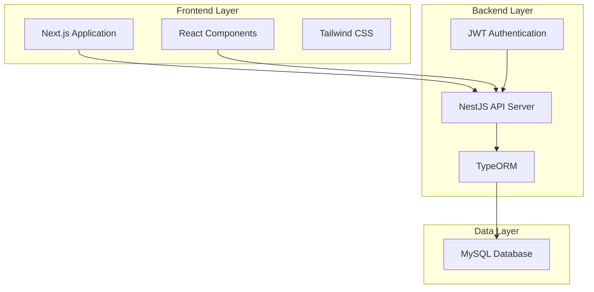

# Front Desk System at a Clinic - Design Document

## Overview

The Front Desk System is a full-stack web application built with NestJS backend and Next.js frontend, designed to manage clinic operations including patient queues, appointments, and doctor profiles. The system follows a modern three-tier architecture with clear separation of concerns, RESTful API design, and responsive user interface.

## Architecture

### High-Level Architecture



### System Components

1. **Frontend (Next.js)**
   - Server-side rendering for optimal performance
   - React-based component architecture
   - Tailwind CSS for responsive design
   - JWT token management for authentication

2. **Backend (NestJS)**
   - RESTful API endpoints
   - JWT-based authentication middleware
   - TypeORM for database operations
   - Input validation and error handling

3. **Database (MySQL)**
   - Relational data storage
   - ACID compliance for data integrity
   - Optimized queries for performance

## Components and Interfaces

### Backend API Structure

#### Authentication Module
```typescript
// Auth Controller Endpoints
POST /auth/login
POST /auth/logout
GET /auth/profile
```

#### Doctor Management Module
```typescript
// Doctor Controller Endpoints
GET /doctors
POST /doctors
PUT /doctors/:id
DELETE /doctors/:id
GET /doctors/:id/availability
```

#### Queue Management Module
```typescript
// Queue Controller Endpoints
GET /queue
POST /queue
PUT /queue/:id/status
DELETE /queue/:id
GET /queue/stats
```

#### Appointment Management Module
```typescript
// Appointment Controller Endpoints
GET /appointments
POST /appointments
PUT /appointments/:id
DELETE /appointments/:id
GET /appointments/available-slots/:doctorId
GET /appointments/history/:patientId
GET /appointments/reports/status-statistics
```

#### Patient Management Module
```typescript
// Patient Controller Endpoints
GET /patients
POST /patients
PUT /patients/:id
DELETE /patients/:id
GET /patients/search?name=:query
```

### Frontend Component Structure

#### Page Components
- `LoginPage` - Authentication interface (`/login`)
- `DashboardPage` - Main dashboard with navigation (`/dashboard`)
- `QueueManagementPage` - Queue operations interface (`/dashboard/queue`)
- `AppointmentManagementPage` - Appointment operations interface (`/dashboard/appointments`)
- `DoctorManagementPage` - Doctor profile management (`/dashboard/doctors`)

#### Shared Components
- `Header` - Navigation with clinic logo, user info, and logout button
- `NavigationTabs` - Tab navigation for Queue Management and Appointment Management
- `Modal` - Reusable modal dialog with backdrop and ESC key support
- `LoadingSpinner` - Loading state indicator for async operations
- `ErrorMessage` - Error display component with user-friendly messages
- `SearchBar` - Real-time search input component
- `FilterDropdown` - Status and category filtering component

#### Feature Components
- `QueueList` - Display patient queue with status updates
- `AppointmentList` - Display appointments with calendar view option
- `DoctorCard` - Doctor information display with status indicators
- `AppointmentForm` - Appointment booking form with validation
- `PatientForm` - Patient information form for queue entry
- `StatusDropdown` - Inline status update dropdown for queue patients
- `CalendarView` - Monthly calendar view for appointments
- `PriorityIndicator` - Visual priority indicators (Normal/Urgent)

### Frontend Routing Structure

#### Route Configuration
```typescript
// Next.js App Router Structure
app/
├── login/
│   └── page.tsx                    // Login page
├── dashboard/
│   ├── page.tsx                    // Main dashboard
│   ├── queue/
│   │   └── page.tsx                // Queue management
│   ├── appointments/
│   │   └── page.tsx                // Appointment management
│   └── doctors/
│       └── page.tsx                // Doctor management
└── layout.tsx                      // Root layout with auth protection
```

#### Authentication Flow
- Unauthenticated users redirected to `/login`
- Successful login redirects to `/dashboard`
- Protected routes require valid JWT token
- Session persistence with automatic token refresh

### API Response Interfaces

```typescript
interface ApiResponse<T> {
  success: boolean;
  data?: T;
  message?: string;
  errors?: string[];
}

interface PaginatedResponse<T> extends ApiResponse<T[]> {
  pagination: {
    page: number;
    limit: number;
    total: number;
    totalPages: number;
  };
}
```

## Data Models

### Database Schema

#### Users Table (Front Desk Staff)
```sql
CREATE TABLE users (
  id INT PRIMARY KEY AUTO_INCREMENT,
  username VARCHAR(50) UNIQUE NOT NULL,
  password_hash VARCHAR(255) NOT NULL,
  role ENUM('front_desk') DEFAULT 'front_desk',
  created_at TIMESTAMP DEFAULT CURRENT_TIMESTAMP,
  updated_at TIMESTAMP DEFAULT CURRENT_TIMESTAMP ON UPDATE CURRENT_TIMESTAMP
);
```

#### Doctors Table
```sql
CREATE TABLE doctors (
  id INT PRIMARY KEY AUTO_INCREMENT,
  name VARCHAR(100) NOT NULL,
  specialization VARCHAR(100) NOT NULL,
  gender ENUM('male', 'female', 'other') NOT NULL,
  location VARCHAR(100) NOT NULL,
  availability_schedule JSON,
  status ENUM('available', 'busy', 'off_duty') DEFAULT 'available',
  created_at TIMESTAMP DEFAULT CURRENT_TIMESTAMP,
  updated_at TIMESTAMP DEFAULT CURRENT_TIMESTAMP ON UPDATE CURRENT_TIMESTAMP
);
```

#### Patients Table
```sql
CREATE TABLE patients (
  id INT PRIMARY KEY AUTO_INCREMENT,
  name VARCHAR(100) NOT NULL,
  contact_info VARCHAR(255),
  medical_record_number VARCHAR(50) UNIQUE,
  created_at TIMESTAMP DEFAULT CURRENT_TIMESTAMP,
  updated_at TIMESTAMP DEFAULT CURRENT_TIMESTAMP ON UPDATE CURRENT_TIMESTAMP
);
```

#### Queue Entries Table
```sql
CREATE TABLE queue_entries (
  id INT PRIMARY KEY AUTO_INCREMENT,
  patient_id INT NOT NULL,
  queue_number INT NOT NULL,
  status ENUM('waiting', 'with_doctor', 'completed') DEFAULT 'waiting',
  priority ENUM('normal', 'urgent') DEFAULT 'normal',
  arrival_time TIMESTAMP DEFAULT CURRENT_TIMESTAMP,
  estimated_wait_time INT, -- in minutes
  created_at TIMESTAMP DEFAULT CURRENT_TIMESTAMP,
  updated_at TIMESTAMP DEFAULT CURRENT_TIMESTAMP ON UPDATE CURRENT_TIMESTAMP,
  FOREIGN KEY (patient_id) REFERENCES patients(id) ON DELETE CASCADE
);
```

#### Appointments Table
```sql
CREATE TABLE appointments (
  id INT PRIMARY KEY AUTO_INCREMENT,
  patient_id INT NOT NULL,
  doctor_id INT NOT NULL,
  appointment_datetime DATETIME NOT NULL,
  status ENUM('booked', 'completed', 'canceled') DEFAULT 'booked',
  notes TEXT,
  created_at TIMESTAMP DEFAULT CURRENT_TIMESTAMP,
  updated_at TIMESTAMP DEFAULT CURRENT_TIMESTAMP ON UPDATE CURRENT_TIMESTAMP,
  FOREIGN KEY (patient_id) REFERENCES patients(id) ON DELETE CASCADE,
  FOREIGN KEY (doctor_id) REFERENCES doctors(id) ON DELETE CASCADE,
  INDEX idx_appointment_datetime (appointment_datetime),
  INDEX idx_doctor_datetime (doctor_id, appointment_datetime)
);
```

### TypeORM Entity Models

#### User Entity
```typescript
@Entity('users')
export class User {
  @PrimaryGeneratedColumn()
  id: number;

  @Column({ unique: true })
  username: string;

  @Column({ name: 'password_hash' })
  passwordHash: string;

  @Column({ type: 'enum', enum: ['front_desk'], default: 'front_desk' })
  role: string;

  @CreateDateColumn({ name: 'created_at' })
  createdAt: Date;

  @UpdateDateColumn({ name: 'updated_at' })
  updatedAt: Date;
}
```

#### Doctor Entity :
```typescript
@Entity('doctors')
export class Doctor {
  @PrimaryGeneratedColumn()
  id: number;

  @Column()
  name: string;

  @Column()
  specialization: string;

  @Column({ type: 'enum', enum: ['male', 'female', 'other'] })
  gender: string;

  @Column()
  location: string;

  @Column({ type: 'json', name: 'availability_schedule' })
  availabilitySchedule: object;

  @Column({ type: 'enum', enum: ['available', 'busy', 'off_duty'], default: 'available' })
  status: string;

  @OneToMany(() => Appointment, appointment => appointment.doctor)
  appointments: Appointment[];

  @CreateDateColumn({ name: 'created_at' })
  createdAt: Date;

  @UpdateDateColumn({ name: 'updated_at' })
  updatedAt: Date;
}
```

#### Patient Entity
```typescript
@Entity('patients')
export class Patient {
  @PrimaryGeneratedColumn()
  id: number;

  @Column()
  name: string;

  @Column({ name: 'contact_info', nullable: true })
  contactInfo: string;

  @Column({ name: 'medical_record_number', unique: true, nullable: true })
  medicalRecordNumber: string;

  @OneToMany(() => QueueEntry, queueEntry => queueEntry.patient)
  queueEntries: QueueEntry[];

  @OneToMany(() => Appointment, appointment => appointment.patient)
  appointments: Appointment[];

  @CreateDateColumn({ name: 'created_at' })
  createdAt: Date;

  @UpdateDateColumn({ name: 'updated_at' })
  updatedAt: Date;
}
```

#### Queue Entry Entity
```typescript
@Entity('queue_entries')
export class QueueEntry {
  @PrimaryGeneratedColumn()
  id: number;

  @Column({ name: 'patient_id' })
  patientId: number;

  @Column({ name: 'queue_number' })
  queueNumber: number;

  @Column({ type: 'enum', enum: ['waiting', 'with_doctor', 'completed'], default: 'waiting' })
  status: string;

  @Column({ type: 'enum', enum: ['normal', 'urgent'], default: 'normal' })
  priority: string;

  @Column({ name: 'arrival_time', type: 'timestamp', default: () => 'CURRENT_TIMESTAMP' })
  arrivalTime: Date;

  @Column({ name: 'estimated_wait_time', nullable: true })
  estimatedWaitTime: number;

  @ManyToOne(() => Patient, patient => patient.queueEntries, { onDelete: 'CASCADE' })
  @JoinColumn({ name: 'patient_id' })
  patient: Patient;

  @CreateDateColumn({ name: 'created_at' })
  createdAt: Date;

  @UpdateDateColumn({ name: 'updated_at' })
  updatedAt: Date;
}
```

#### Appointment Entity
```typescript
@Entity('appointments')
export class Appointment {
  @PrimaryGeneratedColumn()
  id: number;

  @Column({ name: 'patient_id' })
  patientId: number;

  @Column({ name: 'doctor_id' })
  doctorId: number;

  @Column({ name: 'appointment_datetime', type: 'datetime' })
  appointmentDatetime: Date;

  @Column({ type: 'enum', enum: ['booked', 'completed', 'canceled'], default: 'booked' })
  status: string;

  @Column({ type: 'text', nullable: true })
  notes: string;

  @ManyToOne(() => Patient, patient => patient.appointments, { onDelete: 'CASCADE' })
  @JoinColumn({ name: 'patient_id' })
  patient: Patient;

  @ManyToOne(() => Doctor, doctor => doctor.appointments, { onDelete: 'CASCADE' })
  @JoinColumn({ name: 'doctor_id' })
  doctor: Doctor;

  @CreateDateColumn({ name: 'created_at' })
  createdAt: Date;

  @UpdateDateColumn({ name: 'updated_at' })
  updatedAt: Date;
}
```

## Error Handling

### Backend Error Handling Strategy

#### Global Exception Filter
```typescript
@Catch()
export class GlobalExceptionFilter implements ExceptionFilter {
  catch(exception: unknown, host: ArgumentsHost) {
    const ctx = host.switchToHttp();
    const response = ctx.getResponse();
    const request = ctx.getRequest();

    let status = HttpStatus.INTERNAL_SERVER_ERROR;
    let message = 'Internal server error';

    if (exception instanceof HttpException) {
      status = exception.getStatus();
      message = exception.message;
    }

    response.status(status).json({
      success: false,
      message,
      timestamp: new Date().toISOString(),
      path: request.url,
    });
  }
}
```

#### Validation Error Handling
- Use class-validator for DTO validation
- Return structured error responses with field-specific messages
- Implement custom validation pipes for business logic validation

### Frontend Error Handling

#### Error Boundary Component
```typescript
class ErrorBoundary extends React.Component {
  constructor(props) {
    super(props);
    this.state = { hasError: false, error: null };
  }

  static getDerivedStateFromError(error) {
    return { hasError: true, error };
  }

  render() {
    if (this.state.hasError) {
      return <ErrorFallback error={this.state.error} />;
    }
    return this.props.children;
  }
}
```

#### API Error Handling
- Centralized error handling in API service layer
- Toast notifications for user-friendly error messages
- Retry mechanisms for network failures
- Loading states and error states for all async operations

## Testing Strategy

### Backend Testing

#### Unit Tests
- Service layer testing with mocked dependencies
- Controller testing with mocked services
- Entity validation testing
- Utility function testing

#### Integration Tests
- Database integration tests with test database
- API endpoint testing with supertest
- Authentication flow testing
- Business logic integration testing

#### Test Structure Example
```typescript
describe('QueueService', () => {
  let service: QueueService;
  let repository: Repository<QueueEntry>;

  beforeEach(async () => {
    const module = await Test.createTestingModule({
      providers: [
        QueueService,
        {
          provide: getRepositoryToken(QueueEntry),
          useClass: Repository,
        },
      ],
    }).compile();

    service = module.get<QueueService>(QueueService);
    repository = module.get<Repository<QueueEntry>>(getRepositoryToken(QueueEntry));
  });

  describe('addPatientToQueue', () => {
    it('should add patient with correct queue number', async () => {
      // Test implementation
    });
  });
});
```

### Frontend Testing

#### Component Testing
- React Testing Library for component behavior testing
- Jest for unit testing utility functions
- Mock API responses for isolated component testing

#### Integration Testing
- End-to-end testing with Cypress or Playwright
- User flow testing for critical paths
- Cross-browser compatibility testing

#### Test Example
```typescript
describe('QueueManagement', () => {
  it('should add patient to queue', async () => {
    render(<QueueManagement />);
    
    const addButton = screen.getByText('Add Patient to Queue');
    fireEvent.click(addButton);
    
    const nameInput = screen.getByLabelText('Patient Name');
    fireEvent.change(nameInput, { target: { value: 'John Doe' } });
    
    const submitButton = screen.getByText('Add to Queue');
    fireEvent.click(submitButton);
    
    await waitFor(() => {
      expect(screen.getByText('John Doe')).toBeInTheDocument();
    });
  });
});
```

## Security Considerations

### Authentication & Authorization
- JWT tokens with appropriate expiration times
- Secure password hashing using bcrypt
- Protected routes requiring valid authentication
- Role-based access control for different user types

### Data Protection
- Input validation and sanitization
- SQL injection prevention through TypeORM
- XSS protection through proper data encoding
- CSRF protection for state-changing operations

### API Security
- Rate limiting to prevent abuse
- CORS configuration for allowed origins
- Request size limits
- Secure headers implementation

## Performance Optimization

### Backend Performance
- Database query optimization with proper indexing
- Connection pooling for database connections
- Caching strategies for frequently accessed data
- Pagination for large data sets

### Frontend Performance
- Code splitting for reduced bundle sizes
- Lazy loading of components
- Memoization of expensive computations
- Optimized re-rendering with React.memo

### Database Optimization
- Proper indexing on frequently queried columns
- Query optimization for complex joins
- Database connection pooling
- Regular maintenance and monitoring

## Deployment Architecture

### Development Environment
- Local MySQL database
- Hot reloading for both frontend and backend
- Environment-specific configuration files

### Production Environment
- Containerized deployment with Docker
- Load balancing for high availability
- Database clustering for scalability
- SSL/TLS encryption for secure communication

### CI/CD Pipeline
- Automated testing on code commits
- Build and deployment automation
- Environment-specific deployments
- Database migration management

## Monitoring and Logging

### Application Monitoring
- Error tracking and reporting
- Performance metrics collection
- User activity monitoring
- System health checks

### Logging Strategy
- Structured logging with appropriate log levels
- Request/response logging for API calls
- Error logging with stack traces
- Audit logging for sensitive operations

## Frontend UI Design Specifications

### Dashboard Layout Structure

#### Header Component
```typescript
interface HeaderProps {
  user: { username: string; role: string };
  onLogout: () => void;
}

// Header includes:
// - Clinic logo/name (left)
// - User info display (right)
// - Logout button (right)
// - Consistent styling with Tailwind CSS
```

#### Navigation Tabs Component
```typescript
interface NavigationTabsProps {
  activeTab: 'queue' | 'appointments' | 'doctors';
  onTabChange: (tab: string) => void;
}

// Tabs: Queue Management, Appointment Management, Doctor Management
// Active tab indicator with visual distinction
// Maintains session state during navigation
```

### Queue Management Page Design

#### Queue List Layout
```typescript
interface QueueListProps {
  patients: QueuePatient[];
  onStatusUpdate: (patientId: number, status: string) => void;
  onRemoveFromQueue: (patientId: number) => void;
}

// Table columns:
// - Queue # (auto-generated, sequential)
// - Patient Name
// - Arrival Time (timestamp)
// - Estimated Wait Time (calculated)
// - Status (Waiting/With Doctor/Completed)
// - Priority (Normal/Urgent with visual indicators)
// - Actions (Status dropdown, Remove button)
```

#### Queue Management Controls
- "Add New Patient to Queue" button (prominent placement)
- Search bar with real-time filtering
- Status filter dropdown (All, Waiting, With Doctor, Completed)
- Priority indicators with color coding:
  - Normal: Default styling
  - Urgent: Red/orange highlighting

### Appointment Management Page Design

#### Appointment List Layout
```typescript
interface AppointmentListProps {
  appointments: Appointment[];
  viewMode: 'list' | 'calendar';
  onReschedule: (appointmentId: number) => void;
  onCancel: (appointmentId: number) => void;
}

// List view columns:
// - Patient Name
// - Doctor Name
// - Date & Time
// - Status (Booked/Completed/Canceled)
// - Actions (Reschedule, Cancel buttons)
```

#### Calendar View
- Monthly calendar with appointment slots
- Navigation controls (previous/next month)
- Click-to-view appointment details
- Available time slots highlighted
- Booked slots with patient/doctor info

#### Appointment Booking Modal
```typescript
interface AppointmentFormProps {
  doctors: Doctor[];
  availableSlots: TimeSlot[];
  onSubmit: (appointmentData: AppointmentData) => void;
  onCancel: () => void;
}

// Form fields:
// - Patient name input (required)
// - Doctor selection dropdown
// - Available time slots (visual selection)
// - Form validation with error messages
// - Submit and Cancel buttons
```

### Doctor Management Page Design

#### Doctor Cards Layout
```typescript
interface DoctorCardProps {
  doctor: Doctor;
  onEdit: (doctorId: number) => void;
  onDelete: (doctorId: number) => void;
  onViewSchedule: (doctorId: number) => void;
}

// Doctor card includes:
// - Name and specialization
// - Status badge (Available/Busy/Off Duty)
// - Location information
// - Next available appointment time
// - Action buttons (Edit, Delete, View Schedule)
```

#### Status Indicators
- Available: Green badge
- Busy: Yellow/orange badge  
- Off Duty: Red/gray badge

### Modal Dialog System

#### Modal Base Component
```typescript
interface ModalProps {
  isOpen: boolean;
  onClose: () => void;
  title: string;
  children: React.ReactNode;
}

// Modal features:
// - Background overlay with blur effect
// - Close via X button, Cancel button, or ESC key
// - Prevents background interaction when open
// - Form data persistence with confirmation on accidental close
// - Responsive design for different screen sizes
```

### Real-time Updates and State Management

#### State Management Strategy
- React Context for global state (user authentication, notifications)
- React Query for server state management and caching
- Local state for UI interactions and form data
- Real-time updates via WebSocket or polling for queue status

#### Loading and Error States
```typescript
interface LoadingState {
  isLoading: boolean;
  error: string | null;
  data: any;
}

// Loading indicators:
// - Skeleton loaders for list items
// - Spinner for form submissions
// - Progress bars for file operations
// - Disabled states during async operations
```

### Responsive Design Specifications

#### Breakpoint Strategy
- Mobile: 320px - 768px (stacked layout, simplified navigation)
- Tablet: 768px - 1024px (condensed layout, touch-friendly controls)
- Desktop: 1024px+ (full layout with all features)

#### Mobile Adaptations
- Collapsible navigation menu
- Simplified table layouts with essential columns
- Touch-friendly button sizes (minimum 44px)
- Swipe gestures for status updates

### Accessibility Compliance

#### WCAG 2.1 AA Standards
- Keyboard navigation support
- Screen reader compatibility
- Color contrast ratios (minimum 4.5:1)
- Focus indicators for interactive elements
- ARIA labels and descriptions
- Semantic HTML structure

### Performance Optimization

#### Frontend Performance
- Code splitting by route
- Lazy loading of non-critical components
- Image optimization and lazy loading
- Memoization of expensive calculations
- Virtual scrolling for large lists
- Debounced search inputs

#### Bundle Optimization
- Tree shaking for unused code elimination
- Compression and minification
- CDN delivery for static assets
- Service worker for offline functionality

This design document provides a comprehensive blueprint for implementing the Front Desk System, ensuring scalability, maintainability, security, and excellent user experience while meeting all the specified requirements.