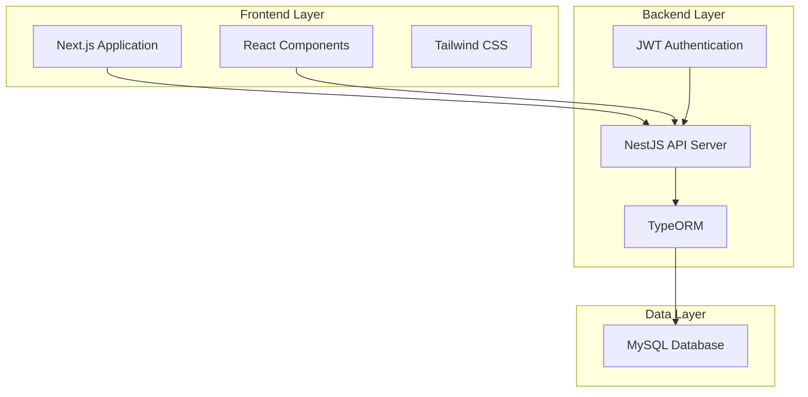

# Front Desk System - Combined Documentation with Cross-Links

## 1. Overview from PDF

Front
Desk
System
at
a
Clinic
Overview
The
Front
Desk
System
is
a
simple
web-based
application
to
manage
patient
queues
and
doctor
appointments
at
a
clinic.
The
front
desk
staff
will
be
able
to:
•
Manage
patient
queues
by
assigning
queue
numbers
to
walk-in
patients.
•
Book,
reschedule,
or
cancel
appointments
for
patients.
•
Track
patient
progress
in
the
queue
and
their
appointment
status
with
doctors.
Technology
Stack
Backend:
●
NestJS
(Node.js
framework
for
building
scalable
server-side
applications)
●
JWT
Authentication
(for
secure
login
and
authorization)
●
TypeORM
(ORM
to
manage
MySQL
database
interactions)
●
MySQL
(database
to
store
user,
doctor,
and
appointment
data)
Frontend:
●
Next.js
(React
framework
for
server-side
rendering
and
static
web
pages)
●
Tailwind
CSS
(for
fast
and
responsive
UI
styling)
Roles
and
Responsibilities
Front
Desk
Staff
●
Manage
Doctor
Profiles:
Add,
edit,
or
delete
doctor
profiles,
including
specialization,
gender,
location,
and
availability.
●
Appointment
Management:
View,
cancel,
or
reschedule
appointments
for
all
patients.
●
Search
and
Filter
Doctors:
Search
doctors
by
specialization,
location,
and
availability.
●
View
All
Appointments:
Admin
can
view
all
appointments
for
any
patient
and
doctor.
Key
Features
Authentication:
●
Implement
login
functionality
for
front
desk
staff
to
securely
access
the
system.
Queue
Management:
●
Front
desk
staff
can
add
walk-in
patients
to
the
queue,
assign
them
queue
numbers,
and
update
their
status
(e.g.,
waiting,
with
doctor ,
completed).
●
View
and
manage
the
queue
efficiently .
Appointment
Management:
●
Front
desk
staff
can
view
available
doctors,
book
appointments,
reschedule
existing
appointments,
or
cancel
appointments
if
necessary .
Appointment
Status:
●
Update
and
track
the
status
of
appointments
(booked,
completed,
canceled).
Frontend
Implementation
Front
Desk
Page
Queue
Management
Page
●
A
list
of
patients
in
the
queue,
showing
their
queue
number
and
current
status.
●
Options
to
update
the
status
of
patients
(e.g.,
“Waiting”,
“With
Doctor”,
“Completed”).
Appointment
Management
View
●
Display
available
doctors
and
their
available
time
slots.
●
Ability
to
book,
cancel,
or
reschedule
appointments.
Bonus
Features(Optional)
Deploy
the
Application
Deploy
the
application
and
share
the
live
link.
Advanced
Queue
Features
Ability
to
prioritize
certain
patients
in
the
queue
(e.g.,
urgent
cases).
UI
Example
This
is
a
demo
UI
feel
free
to
use
your
own
design
and
maybe
surprise
us.
Front
Desk
System

## 2. Requirements Document (with Cross-Links)

# Requirements Document

## Introduction

The Front Desk System is a comprehensive web-based application designed to streamline clinic operations by managing patient queues and doctor appointments. This system empowers front desk staff to efficiently handle walk-in patients, scheduled appointments, and doctor availability while providing real-time tracking of patient progress and appointment statuses.

## Requirements

### Requirement 1: Authentication System

**User Story:** As a front desk staff member, I want to securely log into the system, so that I can access patient and appointment management features with proper authorization.

#### Acceptance Criteria
**Cross-Links:**
- 10.1 → Tasks: 4 references
- 1.1 → Tasks: 3 references
- 1.2 → Tasks: 3 references
- 1.3 → Tasks: 3 references
- 1.4 → Tasks: 3 references
- 1.5 → Tasks: 3 references
- 10.3 → Tasks: 1 references
- 13.1 → Tasks: 1 references
- 13.2 → Tasks: 1 references
- 13.3 → Tasks: 1 references
- 13.4 → Tasks: 2 references
- 13.5 → Tasks: 2 references
- 14.1 → Tasks: 1 references
- 14.6 → Tasks: 2 references
- 14.2 → Tasks: 1 references
- 15.3 → Tasks: 2 references
- 14.3 → Tasks: 1 references
- 14.4 → Tasks: 2 references
- 15.1 → Tasks: 2 references
- 15.2 → Tasks: 2 references
- 14.5 → Tasks: 1 references
- 15.4 → Tasks: 2 references
- 15.5 → Tasks: 1 references
- 16.1 → Tasks: 1 references
- 16.2 → Tasks: 1 references
- 16.3 → Tasks: 1 references
- 16.4 → Tasks: 1 references
- 16.5 → Tasks: 1 references
- 10.4 → Tasks: 1 references
- 10.2 → Tasks: 2 references
- 10.5 → Tasks: 2 references
- 12.3 → Tasks: 1 references

1. WHEN a front desk staff member accesses the system THEN the system SHALL display a login form
2. WHEN valid credentials are entered THEN the system SHALL authenticate using JWT tokens and grant access to the dashboard
3. WHEN invalid credentials are entered THEN the system SHALL display an error message and deny access
4. WHEN a user is authenticated THEN the system SHALL maintain the session securely until logout
5. WHEN a user clicks logout THEN the system SHALL invalidate the JWT token and redirect to login page

### Requirement 2: Doctor Profile Management

**User Story:** As a front desk staff member, I want to manage doctor profiles, so that I can maintain accurate information about available medical professionals and their specializations.

#### Acceptance Criteria
**Cross-Links:**
- 2.1 → Tasks: 3 references
- 2.2 → Tasks: 3 references
- 2.3 → Tasks: 2 references
- 2.4 → Tasks: 2 references
- 2.5 → Tasks: 2 references
- 2.6 → Tasks: 2 references
- 2.7 → Tasks: 1 references

1. WHEN I access doctor management THEN the system SHALL display a list of all doctors with their profiles including specialization, gender, location, and availability
2. WHEN I add a new doctor THEN the system SHALL allow me to enter name, specialization, gender, location, and availability schedule
3. WHEN I edit a doctor profile THEN the system SHALL update the doctor information and reflect changes immediately in all related views
4. WHEN I delete a doctor profile THEN the system SHALL remove the doctor and handle any associated appointments appropriately
5. WHEN I search for doctors THEN the system SHALL filter by specialization, location, and availability status
6. WHEN I view doctor availability THEN the system SHALL show current status (Available, Busy, Off Duty) and next available appointment time
7. WHEN I view all appointments THEN the system SHALL allow me to see appointments for any patient and doctor as an admin function

### Requirement 3: Queue Management System

**User Story:** As a front desk staff member, I want to manage patient queues for walk-in patients, so that I can organize patient flow and minimize waiting times.

#### Acceptance Criteria
**Cross-Links:**
- 3.1 → Tasks: 2 references
- 3.2 → Tasks: 2 references
- 3.3 → Tasks: 2 references
- 3.4 → Tasks: 2 references
- 3.5 → Tasks: 2 references
- 3.6 → Tasks: 2 references
- 3.7 → Tasks: 1 references
- 3.8 → Tasks: 1 references

1. WHEN a walk-in patient arrives THEN the system SHALL allow me to add them to the queue with an auto-generated queue number
2. WHEN I view the queue THEN the system SHALL display patients in order with queue number, name, arrival time, estimated wait time, and current status ("Waiting", "With Doctor", "Completed")
3. WHEN I update a patient's status THEN the system SHALL allow me to change between "Waiting", "With Doctor", and "Completed" states
4. WHEN I need to prioritize a patient THEN the system SHALL allow me to mark them as "Urgent" priority and adjust their position in the queue
5. WHEN I remove a patient from queue THEN the system SHALL update the queue and maintain proper numbering sequence
6. WHEN I search the queue THEN the system SHALL filter patients by name or status
7. WHEN viewing the queue THEN the system SHALL show real-time estimated wait times for each patient
8. WHEN I manage the queue efficiently THEN the system SHALL provide tools to track patient progress and optimize flow

### Requirement 4: Appointment Management System

**User Story:** As a front desk staff member, I want to manage patient appointments, so that I can book, reschedule, and cancel appointments for patients while viewing available doctors and time slots.

#### Acceptance Criteria
**Cross-Links:**
- 4.1 → Tasks: 2 references
- 4.2 → Tasks: 2 references
- 4.3 → Tasks: 2 references
- 4.4 → Tasks: 2 references
- 4.5 → Tasks: 2 references
- 4.6 → Tasks: 2 references
- 4.7 → Tasks: 2 references
- 4.8 → Tasks: 2 references
- 4.9 → Tasks: 2 references

1. WHEN I need to book an appointment THEN the system SHALL display available doctors with their available time slots
2. WHEN I book an appointment THEN the system SHALL require patient name, selected doctor, and chosen time slot
3. WHEN I view appointments THEN the system SHALL display all appointments with patient name, doctor, date, time, and status ("booked", "completed", "canceled")
4. WHEN I reschedule an existing appointment THEN the system SHALL show available alternative slots and update the booking accordingly
5. WHEN I cancel an appointment THEN the system SHALL update the status to "canceled" and make the time slot available again
6. WHEN I need to view appointments THEN the system SHALL allow me to see appointments for all patients and doctors
7. WHEN I filter appointments THEN the system SHALL allow filtering by date, doctor, patient, or appointment status
8. WHEN viewing the appointment calendar THEN the system SHALL display appointments in a monthly calendar view with navigation
9. WHEN I search for appointments THEN the system SHALL allow searching by patient name with real-time results

### Requirement 5: Appointment Status Tracking

**User Story:** As a front desk staff member, I want to track appointment statuses, so that I can monitor appointment progress and maintain accurate records.

#### Acceptance Criteria
**Cross-Links:**
- 5.1 → Tasks: 1 references
- 5.2 → Tasks: 1 references
- 5.3 → Tasks: 1 references
- 5.4 → Tasks: 1 references
- 5.5 → Tasks: 1 references

1. WHEN an appointment is created THEN the system SHALL set the initial status to "booked"
2. WHEN an appointment is completed THEN the system SHALL allow me to update the status to "completed"
3. WHEN an appointment is canceled THEN the system SHALL update the status to "canceled"
4. WHEN I view appointment history THEN the system SHALL display all status changes with timestamps
5. WHEN generating reports THEN the system SHALL provide statistics on appointment statuses

### Requirement 6: Dashboard and Navigation

**User Story:** As a front desk staff member, I want an intuitive dashboard, so that I can quickly access all system features and get an overview of current operations.

#### Acceptance Criteria
**Cross-Links:**
- 6.1 → Tasks: 1 references
- 6.2 → Tasks: 1 references
- 6.3 → Tasks: 1 references
- 6.5 → Tasks: 1 references
- 6.4 → Tasks: 1 references
- 6.6 → Tasks: 1 references

1. WHEN I log in THEN the system SHALL display a "Front Desk Dashboard" with navigation tabs for "Queue Management" and "Appointment Management"
2. WHEN I switch between tabs THEN the system SHALL maintain my current session and display the appropriate interface
3. WHEN viewing the dashboard THEN the system SHALL show an overview of current operations and key information
4. WHEN I need to schedule a new appointment THEN the system SHALL provide a "Schedule New Appointment" button accessible from the appointment management view
5. WHEN I access the queue management page THEN the system SHALL display a list of patients with their queue numbers and status options
6. WHEN I access the appointment management view THEN the system SHALL show scheduled appointments with options to reschedule or cancel

### Requirement 7: Search and Filter Functionality

**User Story:** As a front desk staff member, I want to search and filter information, so that I can quickly find specific patients, doctors, or appointments.

#### Acceptance Criteria
**Cross-Links:**
- 7.1 → Tasks: 3 references
- 7.2 → Tasks: 2 references
- 7.3 → Tasks: 2 references
- 7.4 → Tasks: 2 references
- 7.5 → Tasks: 1 references

1. WHEN I search for patients THEN the system SHALL provide real-time search results as I type
2. WHEN I filter by status THEN the system SHALL show only items matching the selected status
3. WHEN I filter by date THEN the system SHALL display appointments within the specified date range
4. WHEN I clear filters THEN the system SHALL return to showing all items
5. WHEN no results match my search THEN the system SHALL display an appropriate "no results found" message

### Requirement 8: Data Persistence and Integrity

**User Story:** As a front desk staff member, I want reliable data storage, so that patient information and appointments are never lost and remain consistent.

#### Acceptance Criteria
**Cross-Links:**
- 8.1 → Tasks: 3 references
- 8.5 → Tasks: 1 references
- 8.2 → Tasks: 4 references
- 8.3 → Tasks: 2 references

1. WHEN I create or update any record THEN the system SHALL persist the data to the MySQL database
2. WHEN the system experiences an error THEN the system SHALL maintain data integrity and provide appropriate error messages
3. WHEN I perform concurrent operations THEN the system SHALL handle race conditions and prevent data corruption
4. WHEN I access historical data THEN the system SHALL retrieve accurate information from the database
5. WHEN the system starts up THEN the system SHALL verify database connectivity and data integrity

### Requirement 9: Responsive User Interface

**User Story:** As a front desk staff member, I want a responsive and intuitive interface, so that I can efficiently perform my tasks regardless of screen size.

#### Acceptance Criteria
**Cross-Links:**
- 9.1 → Tasks: 1 references
- 9.2 → Tasks: 2 references
- 9.3 → Tasks: 2 references
- 9.4 → Tasks: 1 references
- 9.5 → Tasks: 1 references

1. WHEN I access the system on different devices THEN the system SHALL display a responsive interface that adapts to screen size
2. WHEN I interact with forms THEN the system SHALL provide clear validation messages and intuitive input fields
3. WHEN I perform actions THEN the system SHALL provide immediate visual feedback
4. WHEN I view lists and tables THEN the system SHALL display information in a clear, organized manner
5. WHEN I use the system THEN the system SHALL follow consistent design patterns throughout all pages

### Requirement 10: System Performance and Reliability

**User Story:** As a front desk staff member, I want a fast and reliable system, so that I can serve patients efficiently without system delays or downtime.

#### Acceptance Criteria
**Cross-Links:**
- 10.1 → Tasks: 4 references
- 10.3 → Tasks: 1 references
- 10.4 → Tasks: 1 references
- 10.2 → Tasks: 2 references
- 10.5 → Tasks: 2 references

1. WHEN I perform any action THEN the system SHALL respond within 2 seconds under normal load
2. WHEN multiple users access the system THEN the system SHALL maintain performance and data consistency
3. WHEN the system encounters errors THEN the system SHALL log errors appropriately and provide user-friendly error messages
4. WHEN I refresh the page THEN the system SHALL maintain my current state and session
5. WHEN the system is under heavy load THEN the system SHALL gracefully handle the load without crashing

### Requirement 11: Frontend Implementation Requirements

**User Story:** As a front desk staff member, I want specific frontend pages and interfaces, so that I can efficiently manage queues and appointments through dedicated views.

#### Acceptance Criteria

1. WHEN I access the Front Desk Page THEN the system SHALL provide a main dashboard with clear navigation between queue and appointment management
2. WHEN I access the Queue Management Page THEN the system SHALL display a list of patients in the queue showing their queue number and current status with options to update status
3. WHEN I access the Appointment Management View THEN the system SHALL display available doctors and their available time slots with the ability to book, cancel, or reschedule appointments
4. WHEN I view patient information THEN the system SHALL show relevant details including arrival time, estimated wait time, and priority level
5. WHEN I interact with any interface THEN the system SHALL provide intuitive controls and immediate feedback for all actions

### Requirement 12: Optional Advanced Features

**User Story:** As a front desk staff member, I want advanced queue management capabilities, so that I can handle urgent cases and complex scheduling scenarios more effectively.

#### Acceptance Criteria
**Cross-Links:**
- 12.3 → Tasks: 1 references

1. WHEN I need to prioritize urgent cases THEN the system SHALL allow me to mark patients as urgent and automatically adjust their queue position
2. WHEN managing complex schedules THEN the system SHALL provide advanced filtering and sorting options
3. WHEN the system is deployed THEN the system SHALL be accessible via a live web link for remote access
4. WHEN I need to handle special cases THEN the system SHALL provide flexibility in queue management while maintaining overall organization
### Requ
irement 13: Frontend Routing and Navigation Structure

**User Story:** As a front desk staff member, I want clear navigation and routing between different sections of the system, so that I can efficiently move between queue management, appointment management, and other features.

#### Acceptance Criteria
**Cross-Links:**
- 12.3 → Tasks: 1 references

1. WHEN I access the application THEN the system SHALL provide the following route structure:
   - `/login` - Authentication page
   - `/dashboard` - Main front desk dashboard
   - `/dashboard/queue` - Queue management page
   - `/dashboard/appointments` - Appointment management page
   - `/dashboard/doctors` - Doctor profile management page

2. WHEN I am not authenticated THEN the system SHALL redirect me to `/login` page
3. WHEN I am authenticated THEN the system SHALL allow access to dashboard routes and redirect from `/login` to `/dashboard`
4. WHEN I navigate between dashboard sections THEN the system SHALL maintain the current session and update the active tab indicator
5. WHEN I use browser back/forward buttons THEN the system SHALL maintain proper routing state and navigation context

### Requirement 14: Frontend Design and Layout Structure

**User Story:** As a front desk staff member, I want a well-designed and intuitive interface layout, so that I can efficiently perform my tasks with minimal learning curve.

#### Acceptance Criteria
**Cross-Links:**
- 14.1 → Tasks: 1 references
- 14.6 → Tasks: 2 references
- 14.2 → Tasks: 1 references
- 14.3 → Tasks: 1 references
- 14.4 → Tasks: 2 references
- 14.5 → Tasks: 1 references

1. WHEN I access the dashboard THEN the system SHALL display:
   - Header with clinic logo/name, user info, and logout button
   - Navigation tabs for "Queue Management" and "Appointment Management"
   - Main content area that changes based on selected tab
   - Consistent styling using Tailwind CSS framework

2. WHEN I access the Queue Management page THEN the system SHALL display:
   - Patient queue list with columns: Queue #, Name, Arrival Time, Est. Wait, Status, Priority, Actions
   - "Add New Patient to Queue" button
   - Search bar for filtering patients
   - Status filter dropdown (All, Waiting, With Doctor, Completed)
   - Priority indicators (Normal, Urgent) with visual distinction

3. WHEN I access the Appointment Management page THEN the system SHALL display:
   - List view of appointments with columns: Patient Name, Doctor, Date, Time, Status, Actions
   - "Schedule New Appointment" button
   - Calendar view toggle option
   - Date filter/navigation
   - Search bar for patient names
   - Filter dropdown for appointment status

4. WHEN I access the Schedule New Appointment modal THEN the system SHALL display:
   - Patient name input field
   - Doctor selection dropdown
   - Time slot selection with available slots highlighted
   - "Schedule Appointment" and "Cancel" buttons
   - Form validation messages

5. WHEN I view the Available Doctors section THEN the system SHALL display:
   - Doctor cards with: Name, Specialization, Status badge, Next available time, "View Schedule" button
   - Status indicators: "Available" (green), "Busy" (yellow), "Off Duty" (red)
   - Grid or list layout for doctor information

6. WHEN I interact with any interface element THEN the system SHALL provide:
   - Hover effects on interactive elements
   - Loading states for async operations
   - Success/error notifications for user actions
   - Responsive design that works on desktop and tablet devices
   - Consistent color scheme and typography throughout the application

### Requirement 15: Modal and Dialog Management

**User Story:** As a front desk staff member, I want intuitive modal dialogs for actions like scheduling appointments and updating patient status, so that I can perform tasks without losing context of the main page.

#### Acceptance Criteria
**Cross-Links:**
- 15.3 → Tasks: 2 references
- 15.1 → Tasks: 2 references
- 15.2 → Tasks: 2 references
- 15.4 → Tasks: 2 references
- 15.5 → Tasks: 1 references

1. WHEN I click "Schedule New Appointment" THEN the system SHALL open a modal dialog with appointment booking form
2. WHEN I click "Reschedule" on an appointment THEN the system SHALL open a modal with available time slots for rescheduling
3. WHEN I click status dropdown for a queue patient THEN the system SHALL show inline dropdown options without modal
4. WHEN I click "View Schedule" for a doctor THEN the system SHALL open a modal showing the doctor's daily/weekly schedule
5. WHEN I interact with any modal THEN the system SHALL:
   - Dim the background content
   - Allow closing via "X" button, "Cancel" button, or ESC key
   - Prevent interaction with background content while modal is open
   - Maintain form data if accidentally closed (with confirmation)

### Requirement 16: Real-time Updates and State Management

**User Story:** As a front desk staff member, I want the interface to reflect real-time changes, so that I always see the most current information about queues and appointments.

#### Acceptance Criteria
**Cross-Links:**
- 16.1 → Tasks: 1 references
- 16.2 → Tasks: 1 references
- 16.3 → Tasks: 1 references
- 16.4 → Tasks: 1 references
- 16.5 → Tasks: 1 references

1. WHEN another staff member updates a patient's queue status THEN the system SHALL update the display in real-time without page refresh
2. WHEN a new appointment is booked THEN the system SHALL immediately reflect the change in the appointment list and doctor availability
3. WHEN I update any information THEN the system SHALL provide immediate visual feedback and update related displays
4. WHEN the system is loading data THEN the system SHALL show appropriate loading indicators
5. WHEN there are system errors THEN the system SHALL display user-friendly error messages with suggested actions

## 3. Design Document

# Front Desk System at a Clinic - Design Document

## Overview

The Front Desk System is a full-stack web application built with NestJS backend and Next.js frontend, designed to manage clinic operations including patient queues, appointments, and doctor profiles. The system follows a modern three-tier architecture with clear separation of concerns, RESTful API design, and responsive user interface.

## Architecture

### High-Level Architecture



### System Components

1. **Frontend (Next.js)**
   - Server-side rendering for optimal performance
   - React-based component architecture
   - Tailwind CSS for responsive design
   - JWT token management for authentication

2. **Backend (NestJS)**
   - RESTful API endpoints
   - JWT-based authentication middleware
   - TypeORM for database operations
   - Input validation and error handling

3. **Database (MySQL)**
   - Relational data storage
   - ACID compliance for data integrity
   - Optimized queries for performance

## Components and Interfaces

### Backend API Structure

#### Authentication Module
```typescript
// Auth Controller Endpoints
POST /auth/login
POST /auth/logout
GET /auth/profile
```

#### Doctor Management Module
```typescript
// Doctor Controller Endpoints
GET /doctors
POST /doctors
PUT /doctors/:id
DELETE /doctors/:id
GET /doctors/:id/availability
```

#### Queue Management Module
```typescript
// Queue Controller Endpoints
GET /queue
POST /queue
PUT /queue/:id/status
DELETE /queue/:id
GET /queue/stats
```

#### Appointment Management Module
```typescript
// Appointment Controller Endpoints
GET /appointments
POST /appointments
PUT /appointments/:id
DELETE /appointments/:id
GET /appointments/available-slots/:doctorId
GET /appointments/history/:patientId
GET /appointments/reports/status-statistics
```

#### Patient Management Module
```typescript
// Patient Controller Endpoints
GET /patients
POST /patients
PUT /patients/:id
DELETE /patients/:id
GET /patients/search?name=:query
```

### Frontend Component Structure

#### Page Components
- `LoginPage` - Authentication interface (`/login`)
- `DashboardPage` - Main dashboard with navigation (`/dashboard`)
- `QueueManagementPage` - Queue operations interface (`/dashboard/queue`)
- `AppointmentManagementPage` - Appointment operations interface (`/dashboard/appointments`)
- `DoctorManagementPage` - Doctor profile management (`/dashboard/doctors`)

#### Shared Components
- `Header` - Navigation with clinic logo, user info, and logout button
- `NavigationTabs` - Tab navigation for Queue Management and Appointment Management
- `Modal` - Reusable modal dialog with backdrop and ESC key support
- `LoadingSpinner` - Loading state indicator for async operations
- `ErrorMessage` - Error display component with user-friendly messages
- `SearchBar` - Real-time search input component
- `FilterDropdown` - Status and category filtering component

#### Feature Components
- `QueueList` - Display patient queue with status updates
- `AppointmentList` - Display appointments with calendar view option
- `DoctorCard` - Doctor information display with status indicators
- `AppointmentForm` - Appointment booking form with validation
- `PatientForm` - Patient information form for queue entry
- `StatusDropdown` - Inline status update dropdown for queue patients
- `CalendarView` - Monthly calendar view for appointments
- `PriorityIndicator` - Visual priority indicators (Normal/Urgent)

### Frontend Routing Structure

#### Route Configuration
```typescript
// Next.js App Router Structure
app/
├── login/
│   └── page.tsx                    // Login page
├── dashboard/
│   ├── page.tsx                    // Main dashboard
│   ├── queue/
│   │   └── page.tsx                // Queue management
│   ├── appointments/
│   │   └── page.tsx                // Appointment management
│   └── doctors/
│       └── page.tsx                // Doctor management
└── layout.tsx                      // Root layout with auth protection
```

#### Authentication Flow
- Unauthenticated users redirected to `/login`
- Successful login redirects to `/dashboard`
- Protected routes require valid JWT token
- Session persistence with automatic token refresh

### API Response Interfaces

```typescript
interface ApiResponse<T> {
  success: boolean;
  data?: T;
  message?: string;
  errors?: string[];
}

interface PaginatedResponse<T> extends ApiResponse<T[]> {
  pagination: {
    page: number;
    limit: number;
    total: number;
    totalPages: number;
  };
}
```

## Data Models

### Database Schema

#### Users Table (Front Desk Staff)
```sql
CREATE TABLE users (
  id INT PRIMARY KEY AUTO_INCREMENT,
  username VARCHAR(50) UNIQUE NOT NULL,
  password_hash VARCHAR(255) NOT NULL,
  role ENUM('front_desk') DEFAULT 'front_desk',
  created_at TIMESTAMP DEFAULT CURRENT_TIMESTAMP,
  updated_at TIMESTAMP DEFAULT CURRENT_TIMESTAMP ON UPDATE CURRENT_TIMESTAMP
);
```

#### Doctors Table
```sql
CREATE TABLE doctors (
  id INT PRIMARY KEY AUTO_INCREMENT,
  name VARCHAR(100) NOT NULL,
  specialization VARCHAR(100) NOT NULL,
  gender ENUM('male', 'female', 'other') NOT NULL,
  location VARCHAR(100) NOT NULL,
  availability_schedule JSON,
  status ENUM('available', 'busy', 'off_duty') DEFAULT 'available',
  created_at TIMESTAMP DEFAULT CURRENT_TIMESTAMP,
  updated_at TIMESTAMP DEFAULT CURRENT_TIMESTAMP ON UPDATE CURRENT_TIMESTAMP
);
```

#### Patients Table
```sql
CREATE TABLE patients (
  id INT PRIMARY KEY AUTO_INCREMENT,
  name VARCHAR(100) NOT NULL,
  contact_info VARCHAR(255),
  medical_record_number VARCHAR(50) UNIQUE,
  created_at TIMESTAMP DEFAULT CURRENT_TIMESTAMP,
  updated_at TIMESTAMP DEFAULT CURRENT_TIMESTAMP ON UPDATE CURRENT_TIMESTAMP
);
```

#### Queue Entries Table
```sql
CREATE TABLE queue_entries (
  id INT PRIMARY KEY AUTO_INCREMENT,
  patient_id INT NOT NULL,
  queue_number INT NOT NULL,
  status ENUM('waiting', 'with_doctor', 'completed') DEFAULT 'waiting',
  priority ENUM('normal', 'urgent') DEFAULT 'normal',
  arrival_time TIMESTAMP DEFAULT CURRENT_TIMESTAMP,
  estimated_wait_time INT, -- in minutes
  created_at TIMESTAMP DEFAULT CURRENT_TIMESTAMP,
  updated_at TIMESTAMP DEFAULT CURRENT_TIMESTAMP ON UPDATE CURRENT_TIMESTAMP,
  FOREIGN KEY (patient_id) REFERENCES patients(id) ON DELETE CASCADE
);
```

#### Appointments Table
```sql
CREATE TABLE appointments (
  id INT PRIMARY KEY AUTO_INCREMENT,
  patient_id INT NOT NULL,
  doctor_id INT NOT NULL,
  appointment_datetime DATETIME NOT NULL,
  status ENUM('booked', 'completed', 'canceled') DEFAULT 'booked',
  notes TEXT,
  created_at TIMESTAMP DEFAULT CURRENT_TIMESTAMP,
  updated_at TIMESTAMP DEFAULT CURRENT_TIMESTAMP ON UPDATE CURRENT_TIMESTAMP,
  FOREIGN KEY (patient_id) REFERENCES patients(id) ON DELETE CASCADE,
  FOREIGN KEY (doctor_id) REFERENCES doctors(id) ON DELETE CASCADE,
  INDEX idx_appointment_datetime (appointment_datetime),
  INDEX idx_doctor_datetime (doctor_id, appointment_datetime)
);
```

### TypeORM Entity Models

#### User Entity
```typescript
@Entity('users')
export class User {
  @PrimaryGeneratedColumn()
  id: number;

  @Column({ unique: true })
  username: string;

  @Column({ name: 'password_hash' })
  passwordHash: string;

  @Column({ type: 'enum', enum: ['front_desk'], default: 'front_desk' })
  role: string;

  @CreateDateColumn({ name: 'created_at' })
  createdAt: Date;

  @UpdateDateColumn({ name: 'updated_at' })
  updatedAt: Date;
}
```

#### Doctor Entity :
```typescript
@Entity('doctors')
export class Doctor {
  @PrimaryGeneratedColumn()
  id: number;

  @Column()
  name: string;

  @Column()
  specialization: string;

  @Column({ type: 'enum', enum: ['male', 'female', 'other'] })
  gender: string;

  @Column()
  location: string;

  @Column({ type: 'json', name: 'availability_schedule' })
  availabilitySchedule: object;

  @Column({ type: 'enum', enum: ['available', 'busy', 'off_duty'], default: 'available' })
  status: string;

  @OneToMany(() => Appointment, appointment => appointment.doctor)
  appointments: Appointment[];

  @CreateDateColumn({ name: 'created_at' })
  createdAt: Date;

  @UpdateDateColumn({ name: 'updated_at' })
  updatedAt: Date;
}
```

#### Patient Entity
```typescript
@Entity('patients')
export class Patient {
  @PrimaryGeneratedColumn()
  id: number;

  @Column()
  name: string;

  @Column({ name: 'contact_info', nullable: true })
  contactInfo: string;

  @Column({ name: 'medical_record_number', unique: true, nullable: true })
  medicalRecordNumber: string;

  @OneToMany(() => QueueEntry, queueEntry => queueEntry.patient)
  queueEntries: QueueEntry[];

  @OneToMany(() => Appointment, appointment => appointment.patient)
  appointments: Appointment[];

  @CreateDateColumn({ name: 'created_at' })
  createdAt: Date;

  @UpdateDateColumn({ name: 'updated_at' })
  updatedAt: Date;
}
```

#### Queue Entry Entity
```typescript
@Entity('queue_entries')
export class QueueEntry {
  @PrimaryGeneratedColumn()
  id: number;

  @Column({ name: 'patient_id' })
  patientId: number;

  @Column({ name: 'queue_number' })
  queueNumber: number;

  @Column({ type: 'enum', enum: ['waiting', 'with_doctor', 'completed'], default: 'waiting' })
  status: string;

  @Column({ type: 'enum', enum: ['normal', 'urgent'], default: 'normal' })
  priority: string;

  @Column({ name: 'arrival_time', type: 'timestamp', default: () => 'CURRENT_TIMESTAMP' })
  arrivalTime: Date;

  @Column({ name: 'estimated_wait_time', nullable: true })
  estimatedWaitTime: number;

  @ManyToOne(() => Patient, patient => patient.queueEntries, { onDelete: 'CASCADE' })
  @JoinColumn({ name: 'patient_id' })
  patient: Patient;

  @CreateDateColumn({ name: 'created_at' })
  createdAt: Date;

  @UpdateDateColumn({ name: 'updated_at' })
  updatedAt: Date;
}
```

#### Appointment Entity
```typescript
@Entity('appointments')
export class Appointment {
  @PrimaryGeneratedColumn()
  id: number;

  @Column({ name: 'patient_id' })
  patientId: number;

  @Column({ name: 'doctor_id' })
  doctorId: number;

  @Column({ name: 'appointment_datetime', type: 'datetime' })
  appointmentDatetime: Date;

  @Column({ type: 'enum', enum: ['booked', 'completed', 'canceled'], default: 'booked' })
  status: string;

  @Column({ type: 'text', nullable: true })
  notes: string;

  @ManyToOne(() => Patient, patient => patient.appointments, { onDelete: 'CASCADE' })
  @JoinColumn({ name: 'patient_id' })
  patient: Patient;

  @ManyToOne(() => Doctor, doctor => doctor.appointments, { onDelete: 'CASCADE' })
  @JoinColumn({ name: 'doctor_id' })
  doctor: Doctor;

  @CreateDateColumn({ name: 'created_at' })
  createdAt: Date;

  @UpdateDateColumn({ name: 'updated_at' })
  updatedAt: Date;
}
```

## Error Handling

### Backend Error Handling Strategy

#### Global Exception Filter
```typescript
@Catch()
export class GlobalExceptionFilter implements ExceptionFilter {
  catch(exception: unknown, host: ArgumentsHost) {
    const ctx = host.switchToHttp();
    const response = ctx.getResponse();
    const request = ctx.getRequest();

    let status = HttpStatus.INTERNAL_SERVER_ERROR;
    let message = 'Internal server error';

    if (exception instanceof HttpException) {
      status = exception.getStatus();
      message = exception.message;
    }

    response.status(status).json({
      success: false,
      message,
      timestamp: new Date().toISOString(),
      path: request.url,
    });
  }
}
```

#### Validation Error Handling
- Use class-validator for DTO validation
- Return structured error responses with field-specific messages
- Implement custom validation pipes for business logic validation

### Frontend Error Handling

#### Error Boundary Component
```typescript
class ErrorBoundary extends React.Component {
  constructor(props) {
    super(props);
    this.state = { hasError: false, error: null };
  }

  static getDerivedStateFromError(error) {
    return { hasError: true, error };
  }

  render() {
    if (this.state.hasError) {
      return <ErrorFallback error={this.state.error} />;
    }
    return this.props.children;
  }
}
```

#### API Error Handling
- Centralized error handling in API service layer
- Toast notifications for user-friendly error messages
- Retry mechanisms for network failures
- Loading states and error states for all async operations

## Testing Strategy

### Backend Testing

#### Unit Tests
- Service layer testing with mocked dependencies
- Controller testing with mocked services
- Entity validation testing
- Utility function testing

#### Integration Tests
- Database integration tests with test database
- API endpoint testing with supertest
- Authentication flow testing
- Business logic integration testing

#### Test Structure Example
```typescript
describe('QueueService', () => {
  let service: QueueService;
  let repository: Repository<QueueEntry>;

  beforeEach(async () => {
    const module = await Test.createTestingModule({
      providers: [
        QueueService,
        {
          provide: getRepositoryToken(QueueEntry),
          useClass: Repository,
        },
      ],
    }).compile();

    service = module.get<QueueService>(QueueService);
    repository = module.get<Repository<QueueEntry>>(getRepositoryToken(QueueEntry));
  });

  describe('addPatientToQueue', () => {
    it('should add patient with correct queue number', async () => {
      // Test implementation
    });
  });
});
```

### Frontend Testing

#### Component Testing
- React Testing Library for component behavior testing
- Jest for unit testing utility functions
- Mock API responses for isolated component testing

#### Integration Testing
- End-to-end testing with Cypress or Playwright
- User flow testing for critical paths
- Cross-browser compatibility testing

#### Test Example
```typescript
describe('QueueManagement', () => {
  it('should add patient to queue', async () => {
    render(<QueueManagement />);
    
    const addButton = screen.getByText('Add Patient to Queue');
    fireEvent.click(addButton);
    
    const nameInput = screen.getByLabelText('Patient Name');
    fireEvent.change(nameInput, { target: { value: 'John Doe' } });
    
    const submitButton = screen.getByText('Add to Queue');
    fireEvent.click(submitButton);
    
    await waitFor(() => {
      expect(screen.getByText('John Doe')).toBeInTheDocument();
    });
  });
});
```

## Security Considerations

### Authentication & Authorization
- JWT tokens with appropriate expiration times
- Secure password hashing using bcrypt
- Protected routes requiring valid authentication
- Role-based access control for different user types

### Data Protection
- Input validation and sanitization
- SQL injection prevention through TypeORM
- XSS protection through proper data encoding
- CSRF protection for state-changing operations

### API Security
- Rate limiting to prevent abuse
- CORS configuration for allowed origins
- Request size limits
- Secure headers implementation

## Performance Optimization

### Backend Performance
- Database query optimization with proper indexing
- Connection pooling for database connections
- Caching strategies for frequently accessed data
- Pagination for large data sets

### Frontend Performance
- Code splitting for reduced bundle sizes
- Lazy loading of components
- Memoization of expensive computations
- Optimized re-rendering with React.memo

### Database Optimization
- Proper indexing on frequently queried columns
- Query optimization for complex joins
- Database connection pooling
- Regular maintenance and monitoring

## Deployment Architecture

### Development Environment
- Local MySQL database
- Hot reloading for both frontend and backend
- Environment-specific configuration files

### Production Environment
- Containerized deployment with Docker
- Load balancing for high availability
- Database clustering for scalability
- SSL/TLS encryption for secure communication

### CI/CD Pipeline
- Automated testing on code commits
- Build and deployment automation
- Environment-specific deployments
- Database migration management

## Monitoring and Logging

### Application Monitoring
- Error tracking and reporting
- Performance metrics collection
- User activity monitoring
- System health checks

### Logging Strategy
- Structured logging with appropriate log levels
- Request/response logging for API calls
- Error logging with stack traces
- Audit logging for sensitive operations

## Frontend UI Design Specifications

### Dashboard Layout Structure

#### Header Component
```typescript
interface HeaderProps {
  user: { username: string; role: string };
  onLogout: () => void;
}

// Header includes:
// - Clinic logo/name (left)
// - User info display (right)
// - Logout button (right)
// - Consistent styling with Tailwind CSS
```

#### Navigation Tabs Component
```typescript
interface NavigationTabsProps {
  activeTab: 'queue' | 'appointments' | 'doctors';
  onTabChange: (tab: string) => void;
}

// Tabs: Queue Management, Appointment Management, Doctor Management
// Active tab indicator with visual distinction
// Maintains session state during navigation
```

### Queue Management Page Design

#### Queue List Layout
```typescript
interface QueueListProps {
  patients: QueuePatient[];
  onStatusUpdate: (patientId: number, status: string) => void;
  onRemoveFromQueue: (patientId: number) => void;
}

// Table columns:
// - Queue # (auto-generated, sequential)
// - Patient Name
// - Arrival Time (timestamp)
// - Estimated Wait Time (calculated)
// - Status (Waiting/With Doctor/Completed)
// - Priority (Normal/Urgent with visual indicators)
// - Actions (Status dropdown, Remove button)
```

#### Queue Management Controls
- "Add New Patient to Queue" button (prominent placement)
- Search bar with real-time filtering
- Status filter dropdown (All, Waiting, With Doctor, Completed)
- Priority indicators with color coding:
  - Normal: Default styling
  - Urgent: Red/orange highlighting

### Appointment Management Page Design

#### Appointment List Layout
```typescript
interface AppointmentListProps {
  appointments: Appointment[];
  viewMode: 'list' | 'calendar';
  onReschedule: (appointmentId: number) => void;
  onCancel: (appointmentId: number) => void;
}

// List view columns:
// - Patient Name
// - Doctor Name
// - Date & Time
// - Status (Booked/Completed/Canceled)
// - Actions (Reschedule, Cancel buttons)
```

#### Calendar View
- Monthly calendar with appointment slots
- Navigation controls (previous/next month)
- Click-to-view appointment details
- Available time slots highlighted
- Booked slots with patient/doctor info

#### Appointment Booking Modal
```typescript
interface AppointmentFormProps {
  doctors: Doctor[];
  availableSlots: TimeSlot[];
  onSubmit: (appointmentData: AppointmentData) => void;
  onCancel: () => void;
}

// Form fields:
// - Patient name input (required)
// - Doctor selection dropdown
// - Available time slots (visual selection)
// - Form validation with error messages
// - Submit and Cancel buttons
```

### Doctor Management Page Design

#### Doctor Cards Layout
```typescript
interface DoctorCardProps {
  doctor: Doctor;
  onEdit: (doctorId: number) => void;
  onDelete: (doctorId: number) => void;
  onViewSchedule: (doctorId: number) => void;
}

// Doctor card includes:
// - Name and specialization
// - Status badge (Available/Busy/Off Duty)
// - Location information
// - Next available appointment time
// - Action buttons (Edit, Delete, View Schedule)
```

#### Status Indicators
- Available: Green badge
- Busy: Yellow/orange badge  
- Off Duty: Red/gray badge

### Modal Dialog System

#### Modal Base Component
```typescript
interface ModalProps {
  isOpen: boolean;
  onClose: () => void;
  title: string;
  children: React.ReactNode;
}

// Modal features:
// - Background overlay with blur effect
// - Close via X button, Cancel button, or ESC key
// - Prevents background interaction when open
// - Form data persistence with confirmation on accidental close
// - Responsive design for different screen sizes
```

### Real-time Updates and State Management

#### State Management Strategy
- React Context for global state (user authentication, notifications)
- React Query for server state management and caching
- Local state for UI interactions and form data
- Real-time updates via WebSocket or polling for queue status

#### Loading and Error States
```typescript
interface LoadingState {
  isLoading: boolean;
  error: string | null;
  data: any;
}

// Loading indicators:
// - Skeleton loaders for list items
// - Spinner for form submissions
// - Progress bars for file operations
// - Disabled states during async operations
```

### Responsive Design Specifications

#### Breakpoint Strategy
- Mobile: 320px - 768px (stacked layout, simplified navigation)
- Tablet: 768px - 1024px (condensed layout, touch-friendly controls)
- Desktop: 1024px+ (full layout with all features)

#### Mobile Adaptations
- Collapsible navigation menu
- Simplified table layouts with essential columns
- Touch-friendly button sizes (minimum 44px)
- Swipe gestures for status updates

### Accessibility Compliance

#### WCAG 2.1 AA Standards
- Keyboard navigation support
- Screen reader compatibility
- Color contrast ratios (minimum 4.5:1)
- Focus indicators for interactive elements
- ARIA labels and descriptions
- Semantic HTML structure

### Performance Optimization

#### Frontend Performance
- Code splitting by route
- Lazy loading of non-critical components
- Image optimization and lazy loading
- Memoization of expensive calculations
- Virtual scrolling for large lists
- Debounced search inputs

#### Bundle Optimization
- Tree shaking for unused code elimination
- Compression and minification
- CDN delivery for static assets
- Service worker for offline functionality

This design document provides a comprehensive blueprint for implementing the Front Desk System, ensuring scalability, maintainability, security, and excellent user experience while meeting all the specified requirements.

## 4. Implementation Tasks

# Front Desk System Implementation Plan

## Task Overview

This implementation plan converts the feature design into a series of coding tasks for implementing the Front Desk System. Each task builds incrementally on previous tasks, following test-driven development practices and ensuring no orphaned code.

## Implementation Tasks

- [x] 1. Project Setup and Core Infrastructure
  - Initialize NestJS backend project with TypeScript configuration
  - Set up MySQL database connection with TypeORM
  - Configure environment variables and database connection pooling
  - Create basic project structure with modules (auth, doctors, patients, queue, appointments)
  - Set up Jest testing framework for backend
  - Initialize Next.js frontend project with TypeScript and Tailwind CSS
  - Configure frontend-backend API communication setup
  - _Requirements: 8.1, 8.5, 10.1_

- [x] 2. Database Schema and Entity Models
  - Create MySQL database tables with proper relationships and indexes
  - Implement TypeORM entity models (User, Doctor, Patient, QueueEntry, Appointment)
  - Write database migration scripts for schema creation
  - Create database seeding scripts with sample data for testing
  - Write unit tests for entity model validation and relationships
  - _Requirements: 2.1, 2.2, 8.1, 8.2_

- [x] 3. Authentication System Implementation
  - Implement JWT authentication service with bcrypt password hashing
  - Create User entity and authentication DTOs with validation

  - Build login/logout API endpoints with proper error handling
  - Implement JWT middleware for route protection
  - Create authentication guards and decorators
  - Write unit tests for authentication service and controllers
  - Write integration tests for login/logout flows
  - _Requirements: 1.1, 1.2, 1.3, 1.4, 1.5_

- [x] 4. Doctor Management Backend Implementation
  - Create Doctor service with CRUD operations
  - Implement Doctor controller with all REST endpoints
  - Add doctor search and filtering functionality by specialization, location, and availability
  - Implement doctor availability status management (Available, Busy, Off Duty)
  - Create DTOs for doctor creation, updates, and responses with validation
  - Write unit tests for doctor service methods
  - Write integration tests for doctor API endpoints
  - _Requirements: 2.1, 2.2, 2.3, 2.4, 2.5, 2.6, 2.7_

- [x] 5. Patient Management Backend Implementation
  - Create Patient service with CRUD operations
  - Implement Patient controller with REST endpoints
  - Add patient search functionality with real-time search capabilities
  - Create DTOs for patient creation and updates with validation
  - Implement patient data validation and medical record number uniqueness
  - Write unit tests for patient service methods
  - Write integration tests for patient API endpoints
  - _Requirements: 7.1, 8.1, 8.2_

- [x] 6. Queue Management Backend Implementation
  - Create QueueEntry service with queue operations
  - Implement automatic queue number generation and sequencing
  - Add queue status management (Waiting, With Doctor, Completed)
  - Implement priority handling (Normal, Urgent) with queue reordering
  - Create estimated wait time calculation logic
  - Add queue search and filtering by patient name and status
  - Create DTOs for queue operations with validation
  - Write unit tests for queue service methods including priority logic
  - Write integration tests for queue API endpoints
  - _Requirements: 3.1, 3.2, 3.3, 3.4, 3.5, 3.6, 3.7, 3.8_

- [x] 7. Appointment Management Backend Implementation
  - Create Appointment service with booking, rescheduling, and canceling operations
  - Implement available time slots calculation for doctors
  - Add appointment status tracking (Booked, Completed, Canceled)
  - Create appointment search and filtering by date, doctor, patient, and status
  - Implement appointment history tracking with timestamps
  - Add appointment statistics and reporting functionality
  - Create DTOs for appointment operations with validation
  - Write unit tests for appointment service methods
  - Write integration tests for appointment API endpoints
  - _Requirements: 4.1, 4.2, 4.3, 4.4, 4.5, 4.6, 4.7, 4.8, 4.9, 5.1, 5.2, 5.3, 5.4, 5.5_

- [x] 8. API Error Handling and Validation

  - Implement global exception filter for consistent error responses
  - Add input validation using class-validator for all DTOs
  - Create custom validation pipes for business logic validation
  - Implement structured error responses with field-specific messages
  - Add request logging and error logging with appropriate levels
  - Write tests for error handling scenarios and validation
  - _Requirements: 8.2, 8.3, 10.3_

- [X] 9. Frontend Authentication and Routing Setup
  - Create Next.js App Router structure with protected routes
  - Implement JWT token management and storage
  - Create authentication context and hooks for state management
  - Build login page with form validation and error handling
  - Implement route protection middleware for dashboard routes
  - Add automatic token refresh and session management
  - Create logout functionality with token invalidation
  - Write tests for authentication flows and route protection
  - _Requirements: 1.1, 1.2, 1.3, 1.4, 1.5, 13.1, 13.2, 13.3, 13.4, 13.5_

- [ ] 10. Frontend Dashboard and Navigation Implementation
  - Create main dashboard layout with header and navigation components
  - Implement navigation tabs for Queue Management, Appointment Management, and Doctor Management
  - Build header component with clinic logo, user info, and logout button
  - Add active tab indicators and session state maintenance during navigation
  - Create responsive layout structure using Tailwind CSS
  - Implement dashboard overview with current operations summary and key information
  - Add browser back/forward button support with proper routing state
  - Create consistent styling and typography throughout the application
  - Write component tests for dashboard navigation and layout
  - _Requirements: 6.1, 6.2, 6.3, 14.1, 13.4, 13.5, 14.6_

- [ ] 11. Queue Management Frontend Implementation
  - Create QueueManagementPage component with patient list display
  - Implement queue list table with columns: Queue #, Name, Arrival Time, Est. Wait, Status, Priority, Actions
  - Build "Add New Patient to Queue" functionality with modal form
  - Add real-time search bar for filtering patients by name
  - Implement status filter dropdown (All, Waiting, With Doctor, Completed)
  - Create inline status update dropdown for queue patients
  - Add priority indicators with visual distinction (Normal/Urgent)
  - Implement patient removal from queue functionality
  - Write component tests for queue management features
  - _Requirements: 3.1, 3.2, 3.3, 3.4, 3.5, 3.6, 6.5, 7.1, 7.2, 14.2, 15.3_

- [ ] 12. Appointment Management Frontend Implementation
  - Create AppointmentManagementPage component with appointment list display
  - Implement appointment list table with columns: Patient Name, Doctor, Date, Time, Status, Actions
  - Build "Schedule New Appointment" modal with doctor selection and time slot picker
  - Add calendar view toggle option with monthly calendar display and navigation controls
  - Implement appointment rescheduling modal with available time slots
  - Create appointment cancellation functionality with confirmation
  - Add date filter/navigation and search by patient name with real-time results
  - Implement appointment status filter dropdown
  - Create available doctors section with status indicators and next available time display
  - Add click-to-view appointment details functionality in calendar view
  - Write component tests for appointment management features
  - _Requirements: 4.1, 4.2, 4.3, 4.4, 4.5, 4.6, 4.7, 4.8, 4.9, 6.4, 6.6, 7.3, 7.4, 14.3, 14.4, 15.1, 15.2_

- [ ] 13. Doctor Management Frontend Implementation
  - Create DoctorManagementPage component with doctor cards layout
  - Implement doctor cards with Name, Specialization, Status badge, Location, Next available time
  - Add status indicators with color coding (Available: green, Busy: yellow, Off Duty: red)
  - Build doctor profile creation and editing modals with form validation
  - Implement doctor deletion functionality with confirmation
  - Create "View Schedule" modal showing doctor's daily/weekly schedule
  - Add doctor search and filtering by specialization, location, and availability
  - Write component tests for doctor management features
  - _Requirements: 2.1, 2.2, 2.3, 2.4, 2.5, 2.6, 14.5, 15.4_

- [ ] 14. Modal Dialog System Implementation
  - Create reusable Modal base component with backdrop and ESC key support
  - Implement modal state management and form data persistence
  - Add modal close confirmation for forms with unsaved changes
  - Create consistent modal styling and responsive behavior
  - Implement focus management and accessibility features for modals
  - Add background overlay with blur effect and prevent background interaction
  - Create form validation messages within modals
  - Write tests for modal functionality and user interactions
  - _Requirements: 15.1, 15.2, 15.3, 15.4, 15.5, 14.4_

- [ ] 15. Real-time Updates and State Management
  - Implement React Query for server state management and caching
  - Create real-time update system for queue status changes without page refresh
  - Add optimistic updates for immediate UI feedback when updating information
  - Implement loading states (skeleton loaders, spinners) for all async operations
  - Create toast notification system for success/error user feedback
  - Add automatic data refresh and synchronization between multiple users
  - Implement React Context for global state (authentication, notifications)
  - Create loading and error state management with user-friendly error messages
  - Write tests for real-time updates and state management
  - _Requirements: 16.1, 16.2, 16.3, 16.4, 16.5, 10.1, 10.4_

- [ ] 16. Search and Filter Functionality Implementation
  - Implement real-time search with debounced input for patients, doctors, and appointments
  - Create filter components for status, date, and category filtering
  - Add "Clear Filters" functionality to reset all filters
  - Implement "no results found" messaging for empty search results
  - Create search result highlighting and pagination for large datasets
  - Write tests for search and filter functionality
  - _Requirements: 7.1, 7.2, 7.3, 7.4, 7.5_

- [ ] 17. Responsive Design and Mobile Optimization
  - Implement responsive breakpoints for mobile (320px-768px), tablet (768px-1024px), and desktop (1024px+)
  - Create mobile-friendly navigation with collapsible menu
  - Optimize table layouts for smaller screens with essential columns only
  - Add touch-friendly controls with minimum 44px button sizes
  - Implement swipe gestures for mobile status updates
  - Create stacked layout for mobile with simplified navigation
  - Add hover effects on interactive elements for desktop
  - Ensure consistent design patterns across all screen sizes
  - Test responsive design across different devices and screen sizes
  - _Requirements: 9.1, 9.2, 9.3, 9.4, 9.5, 14.6_

- [ ] 18. Performance Optimization and Caching
  - Implement code splitting and lazy loading for frontend components
  - Add database query optimization with proper indexing
  - Create caching strategies for frequently accessed data
  - Implement pagination for large data sets
  - Add memoization for expensive computations
  - Optimize bundle size and implement compression
  - Write performance tests and monitoring
  - _Requirements: 10.1, 10.2, 10.5_

- [ ] 19. Comprehensive Testing Suite
  - Write end-to-end tests for critical user flows using Cypress or Playwright
  - Create integration tests for complete API workflows
  - Add component tests for all major UI components using React Testing Library
  - Implement accessibility testing with automated tools (WCAG 2.1 AA compliance)
  - Create performance testing for load scenarios and 2-second response time validation
  - Add cross-browser compatibility testing
  - Test keyboard navigation support and screen reader compatibility
  - Validate color contrast ratios and focus indicators
  - Set up continuous integration testing pipeline
  - _Requirements: All requirements validation through testing, 9.2, 9.3, 10.1_

- [ ] 20. Security Implementation and Hardening
  - Implement rate limiting for API endpoints to prevent abuse
  - Add CORS configuration for allowed origins
  - Create input sanitization and XSS protection
  - Implement CSRF protection for state-changing operations
  - Add secure headers and SSL/TLS configuration
  - Create audit logging for sensitive operations
  - Perform security testing and vulnerability assessment
  - _Requirements: 1.1, 1.2, 1.3, 1.4, 1.5, 8.2, 8.3_

- [ ] 21. Deployment and Production Setup
  - Create Docker containers for backend and frontend applications
  - Set up production database with proper configuration and backups
  - Implement CI/CD pipeline for automated testing and deployment
  - Configure load balancing and high availability setup
  - Add monitoring and logging for production environment
  - Create deployment scripts and documentation
  - Deploy application to production environment with live demo link
  - _Requirements: 12.3, 10.2, 10.5_

- [ ] 22. Final Integration and System Testing
  - Perform complete system integration testing
  - Validate all requirements against implemented functionality
  - Test user workflows end-to-end in production environment
  - Create user acceptance testing scenarios
  - Fix any remaining bugs and performance issues
  - Optimize system performance based on testing results
  - Document final system capabilities and usage instructions
  - _Requirements: All requirements final validation_
